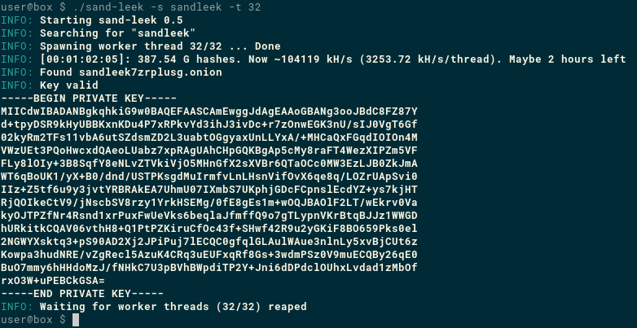

# sand leek
experimental vanity onion address whatchamacallit

## Usage

Typical usage is something like

	sand-leek -s mycoolsite -t 4 > key.pem

to spawn 4 worker threads each looking for a key for an address starting
with 'mycoolsite'. It might find a private key for any of the addresses:

	mycoolsite5avt44.onion
	mycoolsiteane4hb.onion
	mycoolsitewtetnf.onion
	mycoolsiterkom5h.onion

or a large number of other valid addresses. Beware of using too long a
search. While you may luck out and get a key quickly, on average, it
may take a very long time to crack a long search.

## Platforms Supported

Travis CI performs automated builds and tests on:

* OSX
* Linux

platforms with both gcc and clang.

Builds and tests have been successfully carried out for:

* Windows with MinGW on Linux - I cannot support coloured  output for Windows
* Solaris 10

but these are not automated, nor are they part of the primarily supported
platforms.

## Future work
I am currently finishing and tidying GPU capability on sand leek, through OpenCL.

## Benchmarks
Preliminary benching shows sand leek to be faster than some of the other
similar tools out there when pushing work across cores.

| CPU(s)                                       | CPU GHz | Max throughput | -t | Notes      |
|----------------------------------------------|--------:|---------------:|---:|------------|
| 2× Intel(R) Xeon(R) CPU E5-2680 v2           |     2.8 |     147.5 MH/s | 20 | x64 Linux  |
| 2× Intel(R) Xeon(R) CPU E5-2680 v2           |     2.8 |     136.3 MH/s | 40 | x64 Linux  |
| 2× Intel(R) Xeon(R) CPU E5-2670 0            |     2.6 |     108.1 MH/s | 32 | x64 Linux  |
| Intel(R) Core(TM) i7-6700 CPU                |     3.7 |      44.3 MH/s |  8 | x64 Linux  |
| Intel(R) Core(TM) i7-4770 CPU                |     3.7 |      40.0 MH/s |  8 | x64 Linux  |
| Intel(R) Celeron(R) CPU J3455                |     2.2 |      32.8 MH/s |  4 | x64 Linux  |
| AMD A6-3430MX with Radeon(TM) HD Graphics    |     1.7 |      12.8 MH/s |  4 | Win64      |
| Sun Microsystems UltraSPARC-T2               |     1.2 |       7.4 MH/s | 64 | Solaris 10 |
| ARMv7 Processor rev 4 (v7l)                  |     1.2 |       5.3 MH/s |  4 | RPi 3      |
| AMD A4-1200 APU with Radeon(TM) HD Graphics  |     1.0 |       2.8 MH/s |  2 | x64 Linux  |
| Intel(R) Pentium(R) M processor 1.60GHz      |     1.6 |       1.9 MH/s |  1 | x32 Linux  |
| ARMv6-compatible processor rev 7 (v6l)       |     0.7 |      0.26 MH/s |  1 | RPi B+     |

## Inspiration
sand leek was greatly inspired by schallot, escahlot and scallion.

## Compile-time flags

* `SAND_LEEK_DISABLE_COLOUR` - Don't compile in any support for coloured output. Recommended for Windows builds unless support can be had for ANSI escape sequences
